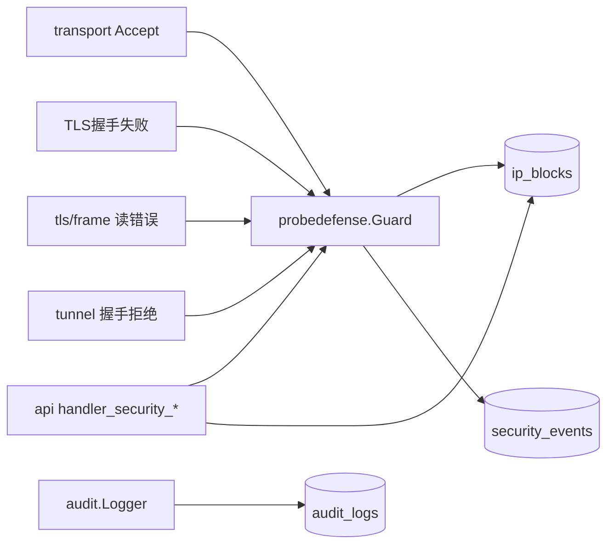

# HaoVPN 代码库导读

> **定位**：新人 / 新对话快速建立「项目是什么、代码在哪」的全局图景。  
> **详细 CODEMAP**（改 X 找哪）仍以 [architecture.md](architecture.md) 与 [internal/README.md](../internal/README.md) 为**单一权威来源**；本文不复制完整 FAQ 表格。

接手请先读 [记忆.md](../记忆.md) 阅读顺序。

---

## 1. 根目录

| 路径 | 职责 |
|------|------|
| [`VERSION`](../VERSION) | **唯一版本号**（仅开发者可改；AI 禁止修改） |
| [`README.md`](../README.md) | 产品简介、快速启动、文档入口 |
| [`记忆.md`](../记忆.md) | 接手阅读顺序与当前阶段 |
| [`cmd/`](../cmd/) | 三个二进制入口（见 [cmd/README.md](../cmd/README.md)） |
| [`internal/`](../internal/) | **全部核心逻辑**（见下文分层） |
| [`web/`](../web/) | WebUI 模板 + `static/*.js`（`go:embed`，见 [web/README.md](../web/README.md)） |
| [`scripts/`](../scripts/) | 构建、验收、field gate（见 [scripts/README.md](../scripts/README.md)） |
| [`docs/`](../docs/) | 活文档（本目录） |
| [`bin/`](../bin/) | `build-local.ps1` 输出 |
| [`dist/`](../dist/) | `build-release.ps1` 交叉编译输出 |

---

## 2. internal/ 分层总览

```
应用编排层    serverapp / clientapp / clientgui
              ↓ 组装 HTTP、隧道、TUN、探针、持久化
领域层        vpnaccount / sessionmgr / auth / probedefense
协议层        api / tunnel / transport / tun / netstack
持久化        persist / logstore / audit
叶子工具      netutil / fileutil / timeutil / paginate / safeutil / dialerr / autherr / logger / security / config / readmodel / platform / …
```

**依赖底线**（详见 architecture § 依赖规则）：

- 叶子包（`netutil`、`fileutil`、`safeutil`、`dialerr`…）**不得** import `api` / `serverapp` / `sessionmgr`
- `serverapp` **可以** import `api` 以启动 HTTP（`boot_api.go`）；公网绑定等**审计文案**走 `audit/public_bind.go`，勿把审计逻辑塞回 api
- `clientgui` **不得** import `tunnel`（展示 DTO 走 `clientapp.ManagedRouteView`）；**不得** import `tun` / `winnet` / `credentials`（预热/服务凭据经 `clientapp`）
- `clientapp` **不得** import `winnet`（经 `netstack` 门面）
- peer 写路径经 `vpnaccount.PeerPolicyApplier`（`peer_write.go`），api 只做 HTTP
- `tunnel` **不得** import `probedefense`；`autherr` **不得** import `transport`

---

## 3. 应用编排（改启动 / 客户端引擎）

### serverapp — 服务端启动

| 文件 | 做什么 |
|------|--------|
| `engine.go` / `engine_boot.go` | 总入口与启动顺序 |
| `boot_persist.go` | SQLite、自检、admin、**公网绑定审计**（`audit.LogPublicBindEnabled`） |
| `boot_session.go` | 探针 Guard 挂载 transport |
| `boot_tun.go` / `boot_tunnel.go` / `boot_api.go` | TUN、隧道 listener、管理 API |

### clientapp — CLI / 服务 / GUI 共用拨号引擎

| 文件 | 做什么 |
|------|--------|
| `bootstrap.go` / `engine_bootstrap.go` | **RunOptions** / `RunCLI` / `RunServiceLoop`；**PrepareEngine** + **StartAndWaitFirstAuth**（GUI 登录） |
| `connect_failure.go` / `connect_warn.go` / `dial_errors.go` | 首连失败 / 已连告警 / 拨号 TLS 文案；`ShouldStopReconnectOnDial` |
| `autostart_facade.go` | 登录/服务自启编排（GUI 禁直接 import autostart） |
| `hooks.go` | `AttachDataplaneHook` |
| `warmup.go` | `StartWarmupAsync` / `warmupTun`（包内） |
| `engine_connect.go` / `engine_lifecycle.go` | 拨号、Soft 重连（`protectForReconnect`）、握手 |
| `hard_restart.go` | **HardRestart** / **waitDNSReadyAbort**（settle 中可 abort） |
| `runtime*.go` | TUN、路由、策略增量 apply |
| `runtime_policy.go` | `policy_apply stage=`；首次 `tun_open reason=first_policy`；`mode=open adapter=reuse\|create`；`safeutil.Check` abort |
| `runtime_routes.go` | 清路由：先 RestoreDNS 再 `route_del`（iphlp）；`route_install` |
| `via_exit.go` | via/ICS：指纹跳过；空 local_lans 先 `HasICSResidue`；`Setup(ctx)` |
| `route_view.go` | **`ManagedRouteView`** 展示 DTO（供 GUI 托盘） |
| `fatal_auth.go` / `dial_errors.go` | 封禁 / 鉴权致命错误 UX（直接 `autherr`/`dialerr`，无薄 Is* re-export） |

**重连双路径**：Soft = `transport.ReconnectClient` + 保 dataplane；Hard = `HardRestart`→`StopKeepICS`（有 137→`reuse_live`）。GUI/CLI 禁止第三套编排。

### CLI vs GUI（入口层对照）

| 能力 | 共用（`clientapp.Engine`） | GUI only（`clientgui`） | CLI only（`cmd/client`） |
|------|------------------------------|---------------------------|---------------------------|
| 握手 / 策略 / ICS / 软换 IP | ✅ | | |
| TUN 预热 | ✅ `StartWarmupAsync` | 登录前触发 | `RunCLI` 内触发 |
| 首连 FailFast | ✅ `SetFailFast` | 登录页经 **PrepareEngine** + **StartAndWaitFirstAuth** | `RunCLI` 45s |
| Hard 重连 | ✅ `HardRestart` | 托盘/登出 | 无（服务 stop/start） |
| ICS 告警 | ✅ LastError | 托盘状态条 | stderr `client_user_warn` |
| 管理员 | | UAC 提权 | stderr 警告 |
| 单实例冲突 | ✅ 锁 | 服务接管对话框 | `SingleInstanceHint` |

### clientgui — 桌面托盘（Fyne）

| 文件 | 做什么 |
|------|--------|
| `run.go` | 启动；`clientapp.StartWarmupAsync`；`applyFyneDoMigration` |
| `fyne_meta.go` | `SetMetadata(Migrations.fyneDo)`；构建另须 `-tags migrated_fynedo` |
| `tray.go` / `tray_state.go` / `tray_routes.go` | 托盘菜单；`trayPresentationFromEngine`；Disconnecting；手动重连 |
| `tray_tooltip.go` | 悬停文案：预算 63；IP→连接自→主机；Connecting+IP / 正在断开 |
| `reconnect_dns.go` | 调用 `HardRestart`（abort）；`FormatConnectFailure` 失败文案 |
| `service_takeover.go` | 服务占用协调口：AskServiceTakeover / StopServiceForTakeover |
| `engine_intent.go` / `engine_op_queue.go` | `prepareGUIEngine`；busy 时 pendingIntent+opGen |
| `engine_stop.go` | `beginEngineOp` / **`beginNetworkOp`**；`finishQuitApp` |
| `login.go` / `login_fail.go` / `admin.go` | 登录经 `prepareGUIEngine`；`finishLoginFailure` |

线程规则：后台只算账，UI 只 `fyne.Do`；主线程回调勿再 `DoAndWait`；重活禁止塞进 `Do`。

### Windows 子进程与 IP Helper 调用链

```
clientapp/via_exit.go
    → netstack.HasICSResidue / CleanupICSResidue / RemoveICSAddressesKeepVPN（winnet_facade → winnet）
    → Teardown ICS：ics_enable_windows.disableICSPlatform → winnet.DisableICSSessionContext（非门面导出）
tun assignIPv4（替换式，禁止「已有新 IP 就跳过」）
    → winnet.ReplaceInterfaceIPv4 / SetInterfaceIPv4OnIndex（删 ≠ want → create；失败 netsh/PS）
    → 埋点 tun_addrs_before/after；同 IP 重入 removed 可为空
vpn_ip_change
    → runtime_policy vpn_ip_replace_inplace → ReplaceTUNIPv4KeepICS → ApplyPreferVPNSkipAsSource（iphlp noop/iphlp）
    → routes=keep 若 gw/allowed 未变
    → RestoreDNS poison；servers 未变则跳过重装 DNS
netstack Setup(ctx)/Teardown(ctx)
    → forward_windows.go（IP 转发）
    → nat_windows.go（WinNAT，PSSnippetNew/RemoveNetNat）→ 失败则 ics_egress + ics_enable（ics_plan / nat_outcome）
    → route_ops_windows.go / dns_windows.go
clientgui → beginEngineOp；stopEnginesSerial；StartWarmupAsync / SaveServiceCredentials 仅经 clientapp
所有 PowerShell → RunPSOneShot(Context) / RunPSBestEffort(Context)；模板 → ps_snippets.go
家庭版 → IsWindowsHomeSKU → 跳过 WinNAT → ICS
Stop 打断配网 → cancel runCtx → policy_apply aborted；已进 ICS → Setup(ctx) Kill powershell（日志 ps_kill/ics_abort）
HardRestart DNS settle → safeutil.PollUntil（约 3s，中段 logout/quit 可 abort）
鉴权后 → Engine 早写 vpnIP；applyPolicy 后才 StateConnected（此前 tun_upload_quiesced）
软重连 → sessionmgr HandleInbound 绑 Conn；RegisterVPN Close+Done；crypto Open 成功后 commit replay
冷启动：CLI/GUI 均 `StartWarmupAsync`；warmup Create 后 `disable_v6`；DNS 在 ICS 前（`skip_empty`）；有 137→`reuse_live`，无→Restart+Enable 后 **Go iphlp Prefer**；软换 iphlp SkipAsSource（`iphlp_skipas_windows.go`）
HardRestart → `ICSPreserve`；Logout → `ICSDisable`（`netstack/ics_lifecycle.go`）
ICS PS 日志统一 → `winnet.LogICSPowerShellLines`；137 探测 → `InterfaceHasICSPrivate` / `HasICSResidue`
托盘悬停 → trayTooltipInputNow（busy；sticky 优先）→ systray.SetTooltip
登录失败 → finishLoginFailure（红字+sticky → 串行 Stop / busy 则 pending logout）
```

---

## 4. 管理 API 与 WebUI

### api — HTTP 薄层

| 文件 | 做什么 |
|------|--------|
| `handler_routes.go` | **路由表**（新增 API 先改这里） |
| `auth_handlers.go` | 登录/Session/CSRF；`requireAuth` **注入 Session 到 Context** |
| `session_context.go` | Context 存 Session；`sessionFromRequest` 优先读 Context |
| `httputil.go` | JSON 错误、分页、`requireMethod`、客户端 IP |
| `handler_security_*.go` | 探针事件/封禁/豁免（已按职责拆分） |
| `handler_peers_*.go` | 托管路由、互访、应用生效 |
| `users_*.go` | 账号 CRUD / VPN 策略 |

### web — 前端资源

| 路径 | 对应 API / 页 |
|------|----------------|
| `templates/*.html` | 页面骨架 |
| `static/security_probe.js` | `/security` 探针页（events/blocks/exempts） |
| `static/*.js` | 各管理页逻辑（CSP `script-src 'self'`） |

---

## 5. 安全与探针防御（横切）



| 包 / 文件 | 职责 |
|-----------|------|
| `probedefense/guard.go` | Accept 门禁、RecordReject、ManualBan |
| `probedefense/classify_tls.go` | TLS/帧特征分类 |
| `probedefense/classify_handshake.go` | 握手拒绝 → signature |
| `probedefense/signatures.go` | 特征码常量（与 labels 同源） |
| `probedefense/auto_ban.go` | 窗口计数自动封禁 |
| `probedefense/exempt.go` | 封禁豁免合并 |
| `transport/probe_banner.go` | TLS 前 banner I/O（哨兵/常量在 `dialerr`） |
| `dialerr/` | `ErrIPBanned` / `ErrSourceDenied` / `ErrPlaintextBeforeTLS` / banner 常量 |
| `transport/server.go` | Accept → CheckAccept → `WriteRejectBanner` → Close |
| `clientapp/dial_errors.go` | `FormatDialError` 中文提示 |
| `clientapp/engine_connect.go` | `onDialError`：致命拨号错误置 Idle |
| `persist/security_store.go` | security_events / ip_blocks / exempt SQL |
| `probedefense/manual_ban.go` | ManualBanStore 手动封禁（须过豁免） |
| `autherr/classify.go` | 握手/拨号错误统一分类 + 线上 code |
| `tunnel/handshake_reject.go` | `OnHandshakeReject`（不 import probedefense） |
| `audit/public_bind.go` / `tun_listen.go` | 公网绑定 / TUN 管理口审计 |

**配置语义**（`enabled` / `record_events` / `auto_ban`）：见 [security-hardening.md §4.2](security-hardening.md#42-探针防御与安全事件)。

---

## 6. 协议与数据面

完整包表见 [architecture.md § CODEMAP](architecture.md#internal-包-codemap)。路由/NAT/ICS 相关高频文件：`transport/reconnect.go`、`tunnel/server_handler.go`、`sessionmgr/register*.go` + `route_*.go`、`netstack/winnet_facade.go`。

---

## 7. 叶子工具包（高复用）

完整包表见 [architecture.md § CODEMAP](architecture.md#internal-包-codemap)。任务导向短表见 [internal/README.md](../internal/README.md)。

---

## 8. 改完去哪查

| 场景 | 文档 |
|------|------|
| 改 X 功能找哪个文件 | [architecture.md](architecture.md) FAQ |
| 包索引短表 | [internal/README.md](../internal/README.md) |
| 部署 / 配置项 | [deploy.md](deploy.md) |
| 生产安全清单 | [security-hardening.md](security-hardening.md) |
| 流量走向 | [traffic-routing.md](traffic-routing.md) |
| 进度与轮次 | [dev-log.md](dev-log.md) |

---

*最后更新：2026-09-01 · CLI/GUI bootstrap 对齐 + RunOptions*
