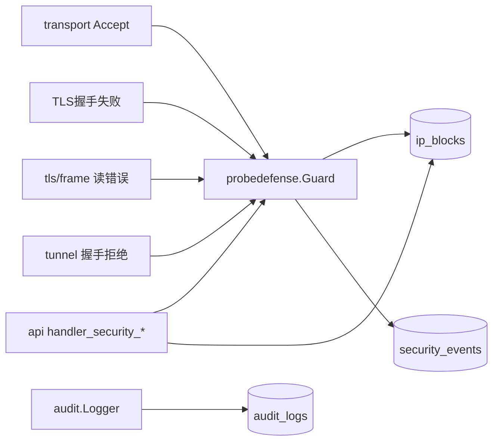

# HaoVPN 代码库导读

> **定位**：新人 / 新对话快速建立「项目是什么、代码在哪」的全局图景。  
> **详细 CODEMAP**（改 X 找哪）仍以 [architecture.md](architecture.md) 与 [internal/README.md](../internal/README.md) 为**单一权威来源**；本文不复制完整 FAQ 表格。

接手请先读 [记忆.md](../记忆.md) 阅读顺序。

---

## 1. 根目录

| 路径 | 职责 |
|------|------|
| [`VERSION`](../VERSION) | **唯一版本号**（仅开发者可改；AI 禁止修改） |
| [`README.md`](../README.md) | 产品简介、快速启动、文档入口 |
| [`记忆.md`](../记忆.md) | 接手阅读顺序与当前阶段 |
| [`cmd/`](../cmd/) | 三个二进制入口（见 [cmd/README.md](../cmd/README.md)） |
| [`internal/`](../internal/) | **全部核心逻辑**（见下文分层） |
| [`web/`](../web/) | WebUI 模板 + `static/*.js`（`go:embed`，见 [web/README.md](../web/README.md)） |
| [`scripts/`](../scripts/) | 构建、验收、field gate（见 [scripts/README.md](../scripts/README.md)） |
| [`docs/`](../docs/) | 活文档（本目录） |
| [`bin/`](../bin/) | `build-local.ps1` 输出 |
| [`dist/`](../dist/) | `build-release.ps1` 交叉编译输出 |

---

## 2. internal/ 分层总览

```
应用编排层    serverapp / clientapp / clientgui
              ↓ 组装 HTTP、隧道、TUN、探针、持久化
领域层        vpnaccount / sessionmgr / auth / probedefense
协议层        api / tunnel / transport / tun / netstack
持久化        persist / logstore / audit
叶子工具      netutil / fileutil / timeutil / paginate / safeutil / logger / security / config / readmodel / platform / …
```

**依赖底线**（详见 architecture § 依赖规则）：

- 叶子包（`netutil`、`fileutil`、`safeutil`…）**不得** import `api` / `serverapp` / `sessionmgr`
- `serverapp` **不得** import `api`（启动审计走 `audit/public_bind.go`）
- `clientgui` **不得** import `tunnel`（展示 DTO 走 `clientapp.ManagedRouteView`）

---

## 3. 应用编排（改启动 / 客户端引擎）

### serverapp — 服务端启动

| 文件 | 做什么 |
|------|--------|
| `engine.go` / `engine_boot.go` | 总入口与启动顺序 |
| `boot_persist.go` | SQLite、自检、admin、**公网绑定审计**（`audit.LogPublicBindEnabled`） |
| `boot_session.go` | 探针 Guard 挂载 transport |
| `boot_tun.go` / `boot_tunnel.go` / `boot_api.go` | TUN、隧道 listener、管理 API |

### clientapp — CLI / 服务共用拨号引擎

| 文件 | 做什么 |
|------|--------|
| `engine_connect.go` / `engine_lifecycle.go` | 拨号、重连、握手 |
| `runtime*.go` | TUN、路由、策略增量 apply |
| `route_view.go` | **`ManagedRouteView`** 展示 DTO（供 GUI 托盘） |
| `fatal_auth.go` / `dial_errors.go` | 封禁 / 鉴权致命错误 UX |

### clientgui — 桌面托盘（Fyne）

| 文件 | 做什么 |
|------|--------|
| `tray.go` / `tray_routes.go` | 托盘菜单与路由展示（依赖 `clientapp`，不依赖 `tunnel`） |
| `login.go` / `admin.go` | 登录与服务提权 |

---

## 4. 管理 API 与 WebUI

### api — HTTP 薄层

| 文件 | 做什么 |
|------|--------|
| `handler_routes.go` | **路由表**（新增 API 先改这里） |
| `auth_handlers.go` | 登录/Session/CSRF；`requireAuth` **注入 Session 到 Context** |
| `session_context.go` | Context 存 Session；`sessionFromRequest` 优先读 Context |
| `httputil.go` | JSON 错误、分页、`requireMethod`、客户端 IP |
| `handler_security_*.go` | 探针事件/封禁/豁免（已按职责拆分） |
| `handler_peers_*.go` | 托管路由、互访、应用生效 |
| `users_*.go` | 账号 CRUD / VPN 策略 |

### web — 前端资源

| 路径 | 对应 API / 页 |
|------|----------------|
| `templates/*.html` | 页面骨架 |
| `static/security_probe.js` | `/security` 探针页（events/blocks/exempts） |
| `static/*.js` | 各管理页逻辑（CSP `script-src 'self'`） |

---

## 5. 安全与探针防御（横切）



| 包 / 文件 | 职责 |
|-----------|------|
| `probedefense/guard.go` | Accept 门禁、RecordReject、ManualBan |
| `probedefense/classify_tls.go` | TLS/帧特征分类 |
| `probedefense/classify_handshake.go` | 握手拒绝 → signature |
| `probedefense/signatures.go` | 特征码常量（与 labels 同源） |
| `probedefense/auto_ban.go` | 窗口计数自动封禁 |
| `probedefense/exempt.go` | 封禁豁免合并 |
| `transport/probe_banner.go` | TLS 前 `HAOVPN:IP_BANNED` |
| `persist/security_store.go` | security_events / ip_blocks / exempt SQL |
| `probedefense/manual_ban.go` | ManualBanStore 手动封禁（须过豁免） |
| `autherr/classify.go` | 握手/拨号错误统一分类 |
| `audit/public_bind.go` / `tun_listen.go` | 公网绑定 / TUN 管理口审计 |

**配置语义**（`enabled` / `record_events` / `auto_ban`）：见 [security-hardening.md §4.2](security-hardening.md#42-探针防御与安全事件)。

---

## 6. 协议与数据面

| 包 | 职责 | 关键文件 |
|----|------|----------|
| **transport** | TLS-TCP 帧、重连、Probe 钩子 | `server.go`, `conn_loops.go`, `probe_banner.go` |
| **tunnel** | 握手、IP 转发 | `server_handler.go`, `handshake_reject.go`, `source_ip.go` |
| **sessionmgr** | 在线会话、报文路由、横向隔离 | `register.go`, `route*.go` |
| **tun** / **netstack** | TUN 设备、路由/DNS/NAT/杀开关 | 平台分文件 |
| **vpnaccount** | 开户、策略、peer 应用生效 | `peer_apply.go`, `peer_policy.go` |

---

## 7. 叶子工具包（高复用）

| 包 | 何时用 |
|----|--------|
| **autherr** | 握手/拨号错误分类 | `classify.go` |
| **netutil** | CIDR/IP/监听/源白名单 | `validate_ip.go`, `source_ip.go`, `CheckSourceIPAllowed` |
| **fileutil** | 原子写、目录、ACL、`RestrictToAdminsOnly` |
| **timeutil** | SQLite UTC、RFC3339、配置秒 → Duration |
| **paginate** | API limit/offset、bool 查询 |
| **safeutil** | `GoSafe`、`RetryN`、Ticker |
| **logger** | 分级日志 + `RedactSensitive` |
| **readmodel** | API 读模型 DTO（与 persist 解耦） |
| **config** | YAML 加载/默认值/校验 |

---

## 8. 改完去哪查

| 场景 | 文档 |
|------|------|
| 改 X 功能找哪个文件 | [architecture.md](architecture.md) FAQ |
| 包索引短表 | [internal/README.md](../internal/README.md) |
| 部署 / 配置项 | [deploy.md](deploy.md) |
| 生产安全清单 | [security-hardening.md](security-hardening.md) |
| 流量走向 | [traffic-routing.md](traffic-routing.md) |
| 进度与轮次 | [dev-log.md](dev-log.md) |

---

*第十九轮（2026-08-31）：autherr、api.listen_tun、TLS Accept 探针、ManualBanStore、validateWebSession、HSTS。*
