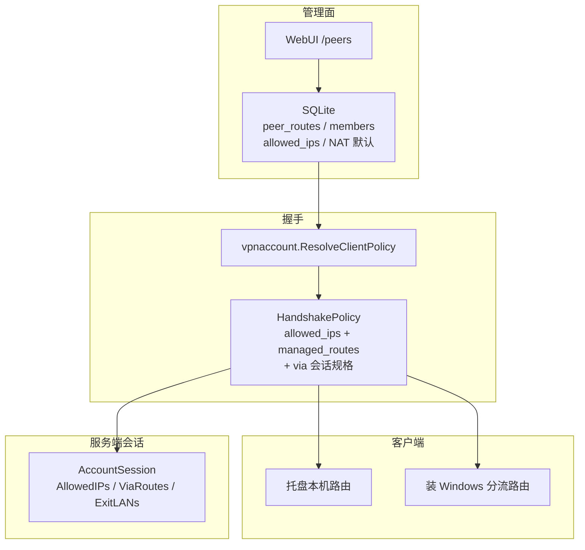
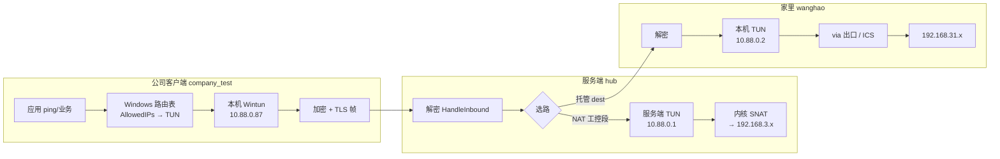
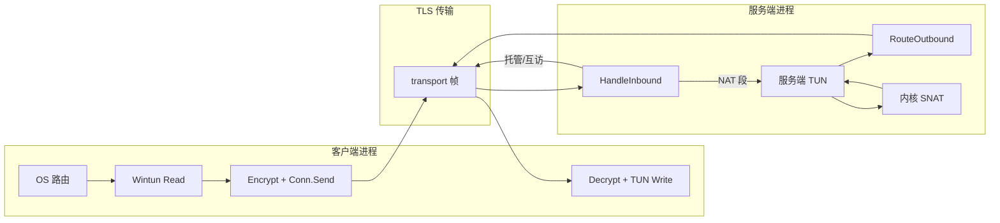
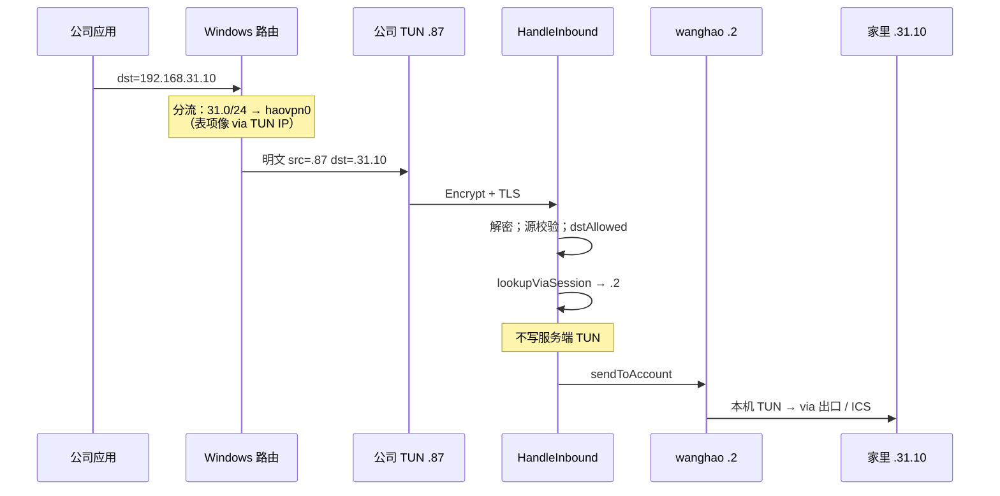
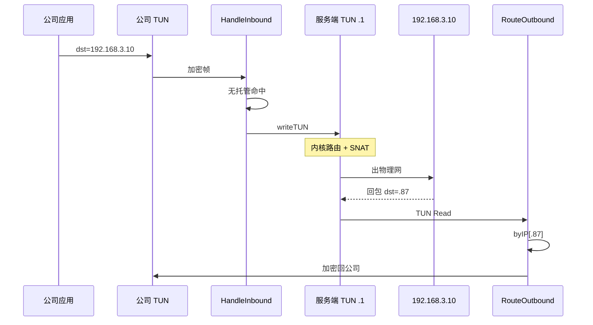
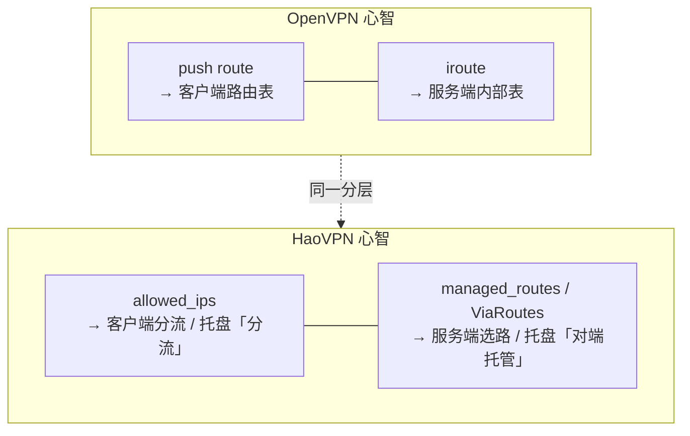

# HaoVPN 流量与路由走向

> **读者**：要理解「托盘本机路由 / Windows 路由表 / 托管 via / 服务端 NAT」各自干什么，以及和 OpenVPN「像配路由器」差在哪。  
> **相关**：概念对照见 [architecture.md](architecture.md)「AllowedIPs vs local_lans vs 托管路由」；现场现象见 [troubleshooting.md](troubleshooting.md)；配置步骤见 [deploy.md](deploy.md)。

本文用现场常见地址举例（可按你的环境替换）：


| 角色     | 账号             | VPN IP       | 后面的网                            |
| ------ | -------------- | ------------ | ------------------------------- |
| 公司客户端  | `company_test` | `10.88.0.87` | —                               |
| 家里 via | `wanghao`      | `10.88.0.2`  | `192.168.31.0/24`（`local_lans`） |
| VPN 网关 | 服务端 TUN        | `10.88.0.1`  | 还可 NAT 到如 `192.168.3.0/24`      |


---

## 1. 先建立心智模型：两层「via」不是一回事

HaoVPN 是 **hub-and-spoke**：每个客户端只和**服务端**建一条加密隧道；客户端之间、客户端到远端 LAN，默认都经服务端转发或 NAT。

```text
┌──────────── 本机 OS 层 ────────────┐    ┌──────── 隧道 / 服务端策略层 ────────┐
│ Windows 路由表：哪些前缀进 TUN？   │ →  │ 服务端：进洞后交给谁？              │
│ （分流 AllowedIPs）               │    │ （托管 via / 横向互访 / 写 TUN+NAT） │
│ 文案常写 via 10.88.0.1            │    │ 托管文案 via 10.88.0.2              │
└───────────────────────────────────┘    └────────────────────────────────────┘
```


| 托盘栏        | 回答的问题               | 谁执行       | 「via」指谁            |
| ---------- | ------------------- | --------- | ------------------ |
| **本机 TUN** | VPN 地址池怎么进洞         | 客户端装路由    | 服务端网关 `.1`         |
| **分流**     | 工控/托管 dest 等前缀要不要进洞 | 客户端装路由    | 展示用网关 `.1`（进 TUN）  |
| **对端托管**   | 洞里这个 dest 转给哪个 peer | **服务端**选路 | 真正的 via 客户端，如 `.2` |


**常见误判**：托盘同时出现  
`192.168.31.0/24 via 10.88.0.1`（分流）和  
`192.168.31.0/24 via 10.88.0.2`（对端托管）  
——**不是冲突**。前者是本机进洞，后者是洞里交给 wanghao。

Windows `route print` 里分流路由常显示「网关 = 本机 TUN IP / 在链路上」：**预期行为**。  
装路由时 **忽略** gateway 参数，改绑 Wintun 接口（on-link）：

```307:309:internal/netstack/route_windows.go
// addClientRoutePlatform 添加分流路由：经 Wintun 接口 on-link（忽略 gateway 作下一跳）。
func addClientRoutePlatform(cidr, tunName, gateway string) error {
	_ = gateway
```

因此：**本机路由表不会、也不该把下一跳设成 `10.88.0.2`**。via 只活在服务端会话策略里。

---

## 2. 策略从哪来（握手一次下齐）

控制台改托管路由 / 互访 / 托管 DNS 后须点 **「应用生效」**（统一入口：脏集 ∩ 当前在线 → bump+Kick；离线下次握手从库读新策略；每 20 账号间隔 50ms）。客户端重连握手拿到完整 `HandshakePolicy`。




| 步骤                      | 代码位置                                                                        | 做什么                                                                                       |
| ----------------------- | --------------------------------------------------------------------------- | ----------------------------------------------------------------------------------------- |
| 合并 AllowedIPs + 托管 dest | `internal/vpnaccount/peer_policy.go` → `ResolveClientPolicy`                | 有效托管的 **dest 并入 AllowedIPs**（否则客户端不装本机路由，包进不了洞）；`ManagedRoutes` 供 GUI；Stale 不进 AllowedIPs |
| 握手组装下发                  | `internal/tunnel/server_handler.go`                                         | 填 `allowed_ips`、`managed_routes`、`vpn_subnet`、网关等；注册会话 `ViaRoutes`                        |
| 客户端落库内存                 | `internal/clientapp/engine_connect.go`                                      | 写入 `gateway` / `allowedIPs` / `managedRoutes`                                             |
| 装/差分系统路由                | `internal/clientapp/runtime_policy.go`、`runtime_routes.go`、`policy_diff.go` | `AddClientRoute`；via/ICS 时可能推迟装路由；ICS 后 PreferVPN + `ScrubTUNDefaultRoute` |
| 托盘展示                    | `internal/clientgui/tray_routes.go` → `trayRouteLines`                      | 本机TUN + 分流 + 对端托管三栏                                                                       |


有效托管合并进 AllowedIPs（关键一行）：

```99:101:internal/vpnaccount/peer_policy.go
			// 有效托管路由：装 dest；会话 ViaRoutes 仅含有效项（见握手组装）
			addCIDR(r.DestCIDR, false)
			out.ManagedRoutes = append(out.ManagedRoutes, info)
```

分流展示固定带本机网关（所以你会看到 via `.1`）：

```73:79:internal/clientgui/tray_routes.go
// formatSplitRouteLine AllowedIPs/NAT 工控段展示行。
func formatSplitRouteLine(cidr, gateway string) string {
	gw := strings.TrimSpace(gateway)
	if gw != "" {
		return fmt.Sprintf("%s via %s", strings.TrimSpace(cidr), gw)
	}
```

**四概念勿混**（与 architecture 一致）：


| 配置                                      | 作用                          |
| --------------------------------------- | --------------------------- |
| 账号 AllowedIPs / `nat.allowed_lan_cidrs` | 经**服务端网关 NAT**访问工控网；托盘「分流」  |
| 客户端 `local_lans`                        | 本机当 via 时广告家里/现场 LAN；开出口    |
| `client_lan_registry`                   | 在线临时广告（断线清空）；alone **不转发**  |
| `peer_routes` + members                 | 谁可走哪条 `dest → via`；托盘「对端托管」 |


---

## 3. 数据面总览（谁读 TUN、谁加密）







| 方向      | 客户端                          | 服务端                                         |
| ------- | ---------------------------- | ------------------------------------------- |
| 本机 → 远端 | TUN Read → Encrypt → Send    | `HandleInbound`：解密 → 直转 peer / 或 `writeTUN` |
| 远端 → 本机 | OnData → Decrypt → TUN Write | TUN Read → `RouteOutbound` → Encrypt → Send |


客户端出站环（本机应用包进洞）：

```162:180:internal/clientapp/engine_connect.go
func (e *Engine) tunReadLoop(ctx context.Context) {
	mtu := netutil.ResolveMTU(e.cfg.Tun.MTU)
	e.rt.readLoop(ctx, func(b []byte) error {
		// ...
		enc, err := sess.Encrypt(b)
		// ...
		return conn.Send(enc)
	}, mtu)
}
```

服务端：隧道入站挂 `HandleInbound`；写 TUN 回调即「交给内核做网关/NAT」：

```287:296:internal/tunnel/server_handler.go
	conn.SetOnData(func(payload []byte) {
		_ = h.SessMgr.HandleInbound(userID, payload, func(pkt []byte) error {
			// ...
			_, err := h.TunDev.Write(pkt)
			return err
		})
	})
```

服务端 TUN 读出站（NAT 回程、发往某 VPN IP 的包）走 `RouteOutbound`：

```30:36:internal/serverapp/boot_api.go
				n, err := tunDev.Read(buf)
				// ...
				_ = bc.sessMgr.RouteOutbound(buf[:n])
```

---

## 4. 服务端选路：`HandleInbound` / `RouteOutbound`

### 4.1 入站（客户端 → 服务端）`HandleInbound`

文件：`internal/sessionmgr/route_inbound.go`

大致顺序（简化）：

1. 解密；源 IP 须为本会话 VPN IP（或 via 的 ExitLANs 回程例外）
2. ExitLAN 回程 → 直转目标 VPN 会话（仅**当前是 via** 时旁路）
3. 目的是其他账号 VPN IP → 须互访策略，然后 `sendToAccount`
4. `dstAllowed`（AllowedIPs 等）校验；越权单播 WARN **10s 限频**（`drops=`）；组播 DEBUG
5. **托管**：`lookupViaSession` 命中 → **直转 via，不写服务端 TUN**
6. 否则 `writeTUN` → 服务端内核路由 / NAT

**双层过滤（分流）**：目的放行单一公式 `[netutil.VPNIPOrInNets](../internal/netutil/ipmatch.go)`（客户端 `[shouldUploadTUN](../internal/clientapp/runtime_tun.go)` + 服务端 `dstAllowed`）。噪声：`IsTUNNoiseDst`（上送早丢）、`IsTUNNoiseForLog`（WARN→DEBUG，含 LL-unicast）、`IsTUNNoiseSource`（伪造源噪声）。越权/伪造 WARN 限频：`[safeutil.AllowEvery](../internal/safeutil/throttle.go)`。

**软 DNS**：握手按账号下发 `dns_servers`（`ResolveDNSForUser` = members−excludes；YAML seed 默认 all 可排除）。**不再**调用 `MergeDNSIntoAllowedIPs`。DNS IP 仅当已被 AllowedIPs/托管路由覆盖时查询才进隧道；否则依赖系统其它网卡 DNS。若必须用公司 DNS 解内网名，请先配置覆盖该 IP 的路由。

**L4 流表挂钩**：`dstAllowed` 通过后 `flowmon.ObservePacket(..., DirIn)`；出站在 `sendToAccount` 侧 `DirOut`。折叠连接页「流量明细」时前端停轮询。

```127:132:internal/sessionmgr/route_inbound.go
	// 托管路由：命中 dest 则直转 via 会话（服务端内核通常无该 LAN 路由）
	if via := m.lookupViaSession(ps, dst); via != nil {
		_ = m.sendToAccount(via, plain)
		return nil
	}
	return writeTUN(plain)
```

### 4.2 出站（服务端 TUN → 某客户端）`RouteOutbound`

文件：`internal/sessionmgr/route.go`

匹配顺序：

1. `byIP[dst]` — 目的就是某账号 VPN IP
2. `viaIndex` — 托管 dest → via 会话
3. **禁止**用会话 AllowedIPs（NAT 工控段）做出站匹配 —— 避免把应 NAT 的流量错送回客户端

```14:17:internal/sessionmgr/route.go
// 匹配顺序：
//  1. byIP[dst] — O(1) 命中某账号 VPN IP；
//  2. viaIndex 命中托管路由 dest → via 账号会话；
//  3. **不再**用会话 AllowedIPs（NAT 工控网段）匹配，避免把应 NAT 的流量错送回客户端。
```

---

## 5. 例 A：公司访问家里 `192.168.31.10`（对端托管）

前置：`wanghao` 配 `local_lans: ["192.168.31.0/24"]` 在线；控制台托管  
`192.168.31.0/24 via 10.88.0.2`，访问方含 `company_test`；已「应用生效」。

### 去程




| 跳          | 处理方         | 代码                                                     |
| ---------- | ----------- | ------------------------------------------------------ |
| OS 进 TUN   | 客户端         | `netstack.AddClientRoute` → Windows on-link            |
| 加密发送       | 客户端         | `engine_connect.tunReadLoop`                           |
| 解密 + 转 via | **服务端**     | `HandleInbound` → `lookupViaSession` → `sendToAccount` |
| 出家里 LAN    | **via 客户端** | `clientapp/via_exit.go` + `netstack` ICS/转发            |


### 回程（要点）

家里主机回包 → wanghao 出口（常对 VPN 子网 SNAT）→ 隧道回服务端 → 源在 ExitLANs 且本会话是 via 时，可直转到 `10.88.0.87` 会话，避免被「伪造源 / 横向隔离」误杀。

排障：`via_exit_setup ok`、注册表有行、托管非「失效」、托盘对端托管显示 `via 10.88.0.2`。见 troubleshooting「托管路由不生效」。

---

## 6. 例 B：公司访问工控 `192.168.3.10`（服务端 NAT）

托盘「分流」有 `192.168.3.0/24 via 10.88.0.1`，**通常没有**对应「对端托管」行。




| 与例 A 的差别     | 例 A 托管     | 例 B NAT    |
| ------------ | ---------- | ---------- |
| 服务端写自己的 TUN？ | 否          | 是          |
| 真正出口         | wanghao 家里 | VPN 服务器机房侧 |
| 须 via 在线？    | 是          | 否          |
| 托盘对端托管       | 有 via `.2` | 通常无        |


---

## 7. 客户端「像不像路由器」——和 OpenVPN 对比

很多人觉得 OpenVPN「更像配路由器」：推送路由、CCD、`iroute`，客户端路由表里常见 `via 10.8.0.1`（VPN 网关），心理模型是「旁边多了一台网关路由器」。

### 7.1 OpenVPN 常见做法（概念）


| OpenVPN 机制                                          | 作用                                    | 体感                       |
| --------------------------------------------------- | ------------------------------------- | ------------------------ |
| `server 10.8.0.0 255.255.255.0` + `topology subnet` | 客户端拿到同网段地址，网关像 `.1`                   | 像局域网 + 网关                |
| `push "route 192.168.31.0 255.255.255.0"`           | **客户端 OS** 把该网段指向 TUN/网关              | 像路由器下发静态路由               |
| `iroute 192.168.31.0 255.255.255.0`（CCD）            | **仅 OpenVPN 服务端进程内**知道该网段在某 client 后面 | 像路由器上的「接口路由 / 下一跳是某拨入用户」 |
| `client-to-client`                                  | 允许客户端之间经服务端转发                         | 像打开路由器客户端隔离开关的反面         |
| `redirect-gateway`                                  | 推默认路由，全隧道                             | 像改默认网关                   |


典型家宽场景（访问某客户端后面的 LAN）：

1. 在 **via 客户端的 CCD** 写 `iroute 192.168.31.0/24`（告诉 **服务端内部**：这段在他后面）
2. 给访问方 `push "route 192.168.31.0/24"`（告诉 **访问方 OS**：这段进 VPN）
3. via 机开 IP 转发 / MASQUERADE（出 LAN）——和 HaoVPN 的 `local_lans` + ICS/出口同类问题

也就是说：OpenVPN 同样是 **「本机 push route + 服务端 iroute」两层**，并不是系统路由表里直接写「下一跳 = 对端客户端 VPN IP」。

### 7.2 对照 HaoVPN


| 能力           | OpenVPN              | HaoVPN                                      |
| ------------ | -------------------- | ------------------------------------------- |
| 客户端要装哪些前缀    | `push route`         | 握手 `allowed_ips`（含 NAT 段 + 托管 dest）         |
| 服务端「这段在谁后面」  | CCD `iroute`         | `peer_routes` → 会话 `ViaRoutes` / `viaIndex` |
| 访问方 UI       | 看 `route print` / 日志 | 托盘：**分流**（进洞）+ **对端托管**（洞里 via）             |
| 经服务器访问机房 LAN | 服务端本机转发/NAT          | `writeTUN` + `nat.allowed_lan_cidrs` SNAT   |
| 横向互访         | `client-to-client` 等 | 默认隔离；`allow_all_vpn_peers` / 互访白名单          |
| Windows 路由表象 | 常 `via 10.8.0.1`（网关） | 常 **on-link / 网关像本机 TUN IP**（实现差异，语义仍是进洞）   |





**为什么 OpenVPN「更像配路由器」？**

1. **术语**：`route` / `iroute` / `topology subnet` 直接借用路由器话术。
2. **路由表观感**：Linux/部分 Windows 场景下一跳写成 VPN 网关 IP，看起来就像「下一跳是路由器」。
3. **运维习惯**：CCD 文件像「每个拨入用户一张静态路由表」。

HaoVPN 分层其实同类，但：

- Windows 实现选了 **Wintun on-link**，表项不像「via `.1` 路由器」那么直观；  
- 产品把两层拆开写在托盘里（分流 vs 对端托管），**更诚实**，也更容易让人以为冲突；  
- 托管与 NAT 在控制台显式建模（访问方、注册表、应用生效），而不是只靠 CCD 文本。

**一句话**：OpenVPN 的「路由器感」多半是 **UI/术语/路由表展示**；底层仍是 hub 上「push 进洞 + iroute 选出口」。HaoVPN 同构，via 在服务端，不在公司机系统下一跳。

---

## 8. 端到端检查清单

公司要通 `192.168.31.x`：

1. 家里客户端：`local_lans` 含该网段，管理员运行，日志 `lan_registry_reported`、`via_exit_setup ok`
2. 控制台注册表可见 → 创建托管路由 → 选访问方 → **应用生效**
3. 公司客户端重连；托盘：分流有 `31.0/24`，对端托管有 `via 10.88.0.2`（非失效）
4. `ping 10.88.0.2`（可选）再 `ping 192.168.31.x`
5. 不通时先看 via 出口/SNAT/ICS，而不是改公司机路由表里的「网关」去指 `.2`

### 多 `local_lans` 与 Windows ICS（via 机）

一张表：


| 何时       | 做什么                                                                                                              |
| -------- | ---------------------------------------------------------------------------------------------------------------- |
| 登录前      | `local_lans` 须 RFC1918、≥/16、可解析；非法 → **挡登录**（不再静默丢弃）                                                             |
| ICS 出站网卡 | ① `windows.outbound_interface`（仅 ICS）→ ② 本机同网段 IP / 专用路由 → ③ **默认网关 `0.0.0.0/0`**（日志 `lan_egress default_route`） |
| 多网段 ICS  | 首块出站网卡生效；同网卡多段一并；异网卡跳过 + `ics_multi_nic`；连接后主窗/日志提示                                                              |
| WinNAT   | 一条 VPN 子网覆盖多 LAN；**不读** `outbound_interface`                                                                     |
| 注册表      | 握手上报 `local_lans`（新客户端不再 ICS 后 sync；旧客户端兼容路径可能仍纠正 Active）                                                        |


- 服务端 NAT 手动网卡：`nat.outbound_interface`（同样仅 ICS）。
- 客户端 via：`windows.outbound_interface` → `netstack.Config.OutboundIf`。
- **ICS 副作用**：EnableSharing 可能扩主机 `/32→/24` 并注入 TUN `0.0.0.0/0`。Prefer **保留 /24**（禁 prefix_fix）+ Go iphlp 清 TUN 默认路由（**无路由 skip，不无条件 PS**）。
- **在线改 VPN IP**：`ApplyPreferVPNSkipAsSource`（iphlp noop/iphlp）；不拆 ICS。

公司要通服务端侧 `192.168.3.x`：

1. 账号 AllowedIPs / 默认 NAT CIDR 含该段
2. 服务端 NAT 就绪（`nat_ok`）
3. 托盘分流有该段；**不需要**对端托管

---

## 9. 代码地图（改路由相关时）

包索引与 FAQ 见 [architecture.md § CODEMAP](architecture.md#internal-包-codemap) 与 [internal/README.md](../internal/README.md)。下表仅列**路由/选路**高频入口：

| 想改什么 | 去哪 |
| -------- | ---- |
| 策略合并 / Stale            | `vpnaccount/peer_policy.go`                                                                                    |
| 握手下发 / 写 TUN 回调         | `tunnel/server_handler.go`                                                                                     |
| 入站选路                    | `sessionmgr/route_inbound.go`（含 `flowmon` DirIn Observe）                                                      |
| 出站选路                    | `sessionmgr/route.go`、`route_lookup.go`（`sendToAccount` DirOut Observe）                                        |
| L4 流表                     | `internal/flowmon`；API `GET /api/v1/monitor/flows`；UI `/connections`                                            |
| 会话 ViaRoutes / viaIndex | `sessionmgr/register.go`                                                                                       |
| 客户端装路由 / 差分             | `clientapp/runtime_routes.go`、`policy_diff.go`、`runtime_policy.go`                                             |
| Windows on-link         | `netstack/route_windows.go`                                                                                    |
| via 出口 ICS              | `clientapp/via_exit.go`、`netstack`（`setupNATForLANs` / `PlanICSByOutbound`* / `FormatICSLocalLANsHint`）；注册表仅握手 |
| 托盘文案                    | `clientgui/tray_routes.go`                                                                                     |
| 管理 API / 应用生效           | `api/handler_peer_*.go`、`handler_dns_servers.go`、`vpnaccount/peer_apply.go`（在线∩限速，每 20/50ms） |


单测锚点：`sessionmgr/peer_route_test.go`（托管直转、禁止 AllowedIPs 出站误匹配）、`clientgui/tray_routes_test.go`（三栏文案）。

---

*文档版本：与 2026-09-02 对齐（软 DNS、应用生效只踢在线+限速、L4 flowmon Observe；ICS Prefer 保留主机 /24；HardRestart KeepICS）；若改选路顺序或 Windows 装路由方式，请同步本文与 troubleshooting。*